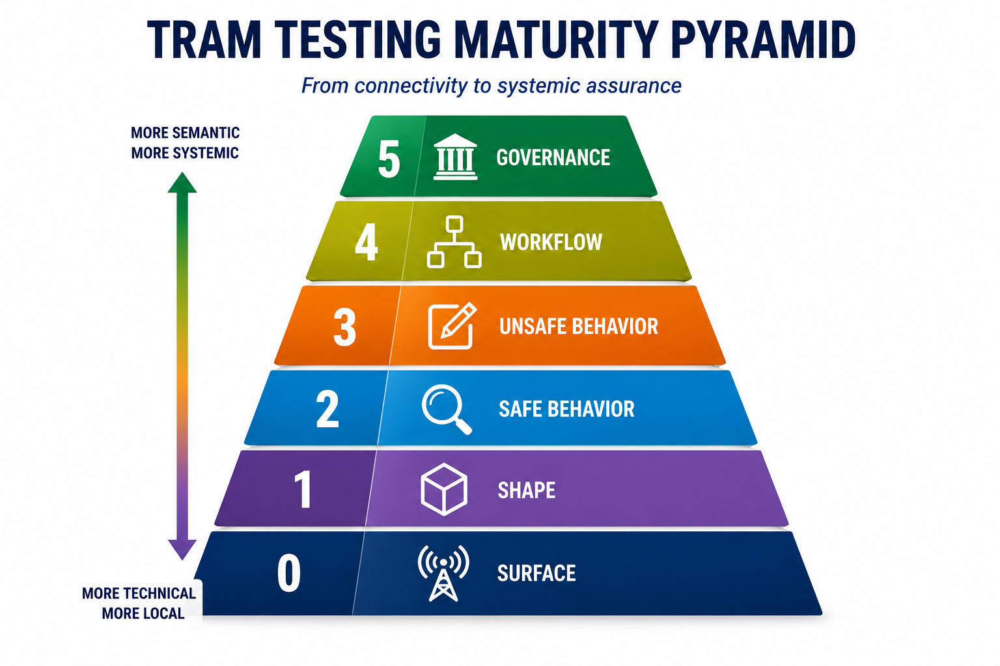

# TRAM

**TRAM** (Test Runner for Assertion Manifests) is a lightweight, dependency-free HTTP API behavioral testing platform built using Node.js.

TRAM models API behavior as executable assertions that produce evidence. Its goal is to verify that observable system behavior continues to align with intended operational outcomes. 

Rather than focusing on implementation details, TRAM focuses on what can be observed at the API surface: the resources, actions, workflows, and rules that define how a system behaves. Assertions are organized into progressively richer layers, moving from endpoint availability and response structure to business behavior, workflows, and governance constraints. This allows teams to express operational intent as a durable behavioral model that remains valuable even as implementations evolve. 

<table>
<tr>
<td valign="top">

<p>TRAM combines:</p>

<ul>
<li>a manifest-driven test format</li>
<li>a reusable assertion engine</li>
<li>a portable HTTP test runner</li>
<li>stable runtime interpolation support</li>
<li>native type assertions</li>
<li>optional property assertions</li>
<li>object-map and collection assertions</li>
<li>layered behavioral modeling</li>
<li>workflow-oriented behavioral validation</li>
<li>an AI Coaching workflow focused on learning and augmentation rather than pure automation</li>
</ul>

</td>
<td width="240" valign="top">


</td>
</tr>
</table>


TRAM treats API testing as behavioral modeling rather than framework scripting.

## Documentation

* [Quick Start](docs/quick-start.md)
* [Explainer](docs/explainer.md)
* [Manifest Specification](docs/manifest-spec.md)
* [Behavioral Modeling for APIs](docs/behavioral-modeling-for-apis.md)
* [Roadmap](docs/roadmap.md)

---

## Smallest complete TRAM manifest

```json
{
  "name": "Smallest TRAM manifest",
  "config": {
    "baseUrl": "http://localhost:3000"
  },
  "tests": [
    {
      "name": "GET /tasks returns 200",
      "method": "GET",
      "path": "/tasks",
      "expect": {
        "status": 200
      }
    }
  ]
}
```

This is the smallest useful complete TRAM manifest:

* one manifest
* one test
* one request
* one behavioral assertion

---

## Why TRAM exists

TRAM explores a narrow problem:

_**How do we make behavioral expectations directly visible,
portable, executable, and reviewable?**_

The core artifact is the manifest:

[api-tests.json](examples/api-tests.json)

The manifest defines:

* requests
* request bodies
* assertions
* expected behaviors
* shared test data
* runtime interpolation values

Assertions become directly inspectable operational statements.

Simple behavioral assertion:

```json
{
  "path": "$.status",
  "equals": "active"
}
````

Meaning:

```text
The resource status must be "active".
```

Optional property assertion for evolving representations:

```json
{
  "path": "$",
  "each": {
    "property": "description",
    "optional": true,
    "type": "string"
  }
}
```

Meaning:

```text
"description" may be absent.
If present, it must be a string.
```

Hypermedia affordance assertion:

```json
{
  "path": "$._links",
  "eachProperty": {
    "hasProperties": ["href", "method"]
  }
}
```

Meaning:

```text
Every affordance must define both a target URL and an HTTP method.
```

Collection behavioral assertion:

```json
{
  "path": "$",
  "each": {
    "property": "status",
    "oneOf": ["active", "pending", "completed"]
  }
}
```

Meaning:

```text
Every returned resource must have a recognized workflow state.
```


Nested affordance traversal assertion:


```json
{
  "path": "$",
  "each": {
    "path": "$._links",
    "eachProperty": {
      "hasProperties": ["href", "method"]
    }
  }
}
```
Meaning:

```text
Every returned resource must expose affordances
that define both a target URL and an HTTP method.
```

TRAM supports partial and evolving representations while preserving explicit behavioral validation.


<!--
Assertions become directly inspectable operational statements.

Simple behavioral assertion:

```json
{
  "path": "$.status",
  "equals": "active"
}
```

Optional property assertion for evolving representations:

```json
{
  "path": "$",
  "each": {
    "property": "description",
    "optional": true,
    "type": "string"
  }
}
```

Hypermedia affordance assertion:

```json
{
  "path": "$._links",
  "eachProperty": {
    "hasProperties": ["href", "method"]
  }
}
```

TRAM supports partial and evolving representations while preserving explicit behavioral validation.
-->

---


## Behavioral layering

TRAM organizes behavioral testing into six progressive layers.

| Level | Focus | Question |
|---|---|---|
| 0 | Surface | Can the API be reached? |
| 1 | Shape | Do resources and affordances appear correctly? |
| 2 | Safe behavior | Do navigation, lookup, filtering, and query interactions behave correctly? |
| 3 | Unsafe behavior | Do isolated state-changing actions behave correctly? |
| 4 | Workflow | Can meaningful operational narratives be completed successfully? |
| 5 | Governance | Are policies, constraints, and semantic rules enforced correctly? |




The layers are additive rather than replacement-oriented. Each layer narrows debugging scope while preserving readable behavioral intent.

---

## Project goals

TRAM is designed around several principles:

* behavioral tests over implementation tests
* portable manifests over framework lock-in
* readable intent over clever abstractions
* explicitness over hidden runtime behavior
* low-noise reporting
* augmentation and learning over one-shot generation

The long-term direction is an AI Coach that helps users learn behavioral API testing while collaboratively constructing executable manifests.

---

## Current implementation

Current implementation includes:

* manifest specification (`api-tests.json`)
* dependency-free assertion engine
* dependency-free HTTP runner
* body/header/status assertions
* collection assertions (`each`)
* object-map assertions (`eachProperty`)
* native type assertions (`type`)
* optional property assertions (`optional`)
* range assertions (`range`)
* stable run-scoped variables
* runtime interpolation (`${data.*}`)
* object injection (`$data.*`)
* happy-path and sad-path testing
* JSON, form, and text request body support
* workflow-oriented behavioral modeling
* machine-readable reporting
* real API validation against a sample CRUD-style task API

---

## Project structure

```text
.
├── README.md
├── package.json
├── api-tests.json
├── bin/
│   └── tram
├── lib/
│   └── assertions.js
├── docs/
└── sample-api/
```

---


## CLI usage

```bash
tram <manifest-file> [options]
```

Options:

```text
-v, --verbose          Print passing assertion details
-r, --report <file>    Write JSON report to file
-h, --help             Show help
```

---

## CLI installation

### Local development setup

Clone the repository:

```bash
git clone https://github.com/mamund/2026-05-tram.git
cd 2026-05-tram
```

macOS/Linux:

```bash
chmod +x bin/tram
npm link
```

Windows:

```bash
npm link
```

Then run:

```bash
tram api-tests.json
```

---

## Core concepts

### Manifest-driven testing

Tests are defined declaratively in a manifest:

```json
{
  "name": "Create task",
  "method": "POST",
  "path": "/tasks/${data.stableId}",
  "body": "$data.task.valid",
  "expect": {
    "status": 201,
    "body": [
      {
        "path": "$.status",
        "equals": "active"
      }
    ]
  }
}
```

The manifest acts as both:

* executable configuration
* behavioral operational artifact

---

### Shared runtime data

The `data` section stores reusable request and runtime values.

Example:

```json
{
  "data": {
    "stableId": "${randomId}"
  }
}
```

The generated value remains stable throughout the current test run.

Later requests can reference the same value:

```json
{
  "path": "/tasks/${data.stableId}"
}
```

This enables coordinated multi-step behavioral flows without introducing custom scripting.

---

### Runtime interpolation semantics

Use:

```json
"$data.someObject"
```

when injecting structured runtime objects.

Use:

```json
"${data.someValue}"
```

when interpolating values inside strings.

Examples:

Correct object injection:

```json
"body": "$data.createTask"
```

Correct string interpolation:

```json
"path": "/tasks/${data.knownTaskId}"
```

---

### Assertion engine

The assertion library currently supports:

```text
exists
equals
contains
oneOf
type
range
isArray
hasProperties
minLength
each
eachProperty
```

Native type assertions support:

```text
string
number
boolean
array
object
null
```

Example native type assertion:

```json
{
  "path": "$.priority",
  "type": "number"
}
```

Example optional property assertion:

```json
{
  "path": "$",
  "each": {
    "property": "description",
    "optional": true,
    "type": "string"
  }
}
```

This assertion means:

```text
"description" may be absent
if present, it must still validate as a string
```

---

### Traversal semantics

TRAM distinguishes between arrays and object maps.

Use:

* `each` for arrays
* `eachProperty` for object maps

Examples:

```json
[
  {...},
  {...}
]
```

```text
=> each
```

```json
{
  "self": {...},
  "edit": {...}
}
```

```text
=> eachProperty
```

TRAM also distinguishes between:

* `path` for structural traversal
* `property` for scalar leaf checks

Example structural traversal:

```json
{
  "path": "$",
  "each": {
    "path": "$._links",
    "eachProperty": {
      "hasProperties": ["href", "method"]
    }
  }
}
```

Example scalar leaf assertion:

```json
{
  "path": "$",
  "each": {
    "property": "status",
    "equals": "active"
  }
}
```

The assertion model supports:

* collection traversal
* nested traversal
* object-map iteration
* native value validation
* optional property validation
* hypermedia affordance validation

while remaining declarative and inspectable.

TRAM intentionally limits type assertions to native value categories.

The following are currently out of scope:

```text
uuid
email
uri
date-time
schema validation
```

---

### Workflow-oriented behavioral modeling

TRAM manifests can model operational workflows rather than isolated endpoint checks.

TRAM models workflows through declarative sequencing rather than embedded scripting.

A workflow manifest may:

* create resources
* retrieve intermediate state
* apply mutations
* verify accumulated final state

This allows manifests to function as executable operational narratives.

Example workflow sequence:

```text
create
read after create
edit
update status
assign user
set due date
read final accumulated state
```

---

### Header assertion semantics

Header assertions use:

```json
{
  "name": "content-type",
  "contains": "application/json"
}
```

Do not use `path` for header assertions.

---

### Request body support

TRAM supports multiple request body encodings:

```text
json
form
text
```

Example:

```json
{
  "method": "PUT",
  "path": "/tasks/task-1/status",
  "bodyType": "form",
  "body": "$data.task.updateStatus"
}
```

---

## Running the sample project

Start the sample API:

```bash
node sample-api/index.js
```

Run the test suite:

```bash
tram api-tests.json
```

Verbose mode:

```bash
tram api-tests.json --verbose
```

Generate a machine-readable report:

```bash
tram api-tests.json --report results.json
```

---

## Documentation

### Quick Start

[Practical walkthrough](docs/quick-start.md) for:

* running the sample project
* inspecting manifests
* understanding assertions
* understanding runtime interpolation
* exploring behavioral API testing workflows

### Manifest Specification

Authoritative executable [manifest model](docs/manifest-spec.md).

Defines:

* manifest structure
* request configuration
* assertion syntax
* optional property assertions
* traversal behavior
* runtime interpolation
* stable run-scoped variables
* collection assertions
* object-map assertions
* native type assertions
* body handling

### Explainer

Architectural [discussion](docs/explainer.md) of:

* behavioral assertions
* operational artifacts
* hypermedia-oriented testing
* generated systems
* workflow-oriented behavioral modeling
* AI-assisted workflows

---


## Validation pipeline

TRAM validates manifests before running HTTP requests.

Validation currently includes:

* manifest file existence
* manifest JSON parsing
* top-level manifest structure
* required test fields
* supported HTTP methods
* supported request body types
* duplicate test IDs

Invalid manifests fail before execution begins.

TRAM reports multiple manifest validation problems in a single pass when possible.

TRAM distinguishes between:

* manifest authoring failures
* request/runtime failures
* behavioral assertion failures

---

## Reporting philosophy

TRAM emphasizes:

* low-noise console output
* readable failures
* behavior visibility
* detailed machine-readable reports

The console output is intentionally concise by default.

---

## Design philosophy

TRAM is intentionally conservative.

v0.1 avoids:

* framework dependencies
* custom scripting
* setup/teardown orchestration
* schema engines
* plugin systems
* hidden runtime behavior

The current emphasis is:

```text
clarity
predictability
behavior visibility
manifest ergonomics
reviewability
```

---

## AI Coaching direction

The AI Coaching direction includes:

* layered manifest generation
* traversal-aware assertion guidance
* workflow modeling support
* governance distinction guidance
* collaborative review cycles
* behavioral decomposition assistance

The eventual AI Coach layer will:

1. inspect `server.js` and/or API Story documents
2. identify API behaviors
3. propose candidate tests
4. distinguish happy and sad paths
5. review assertions collaboratively
6. generate plausible first-pass manifests

The goal is not automatic test generation alone.

The goal is helping users understand behavioral API testing while collaboratively constructing executable manifests.

---

## Example layer progression

Typical TRAM progression:

```text
Level 0 — endpoint availability
Level 1 — representation structure
Level 2 — lookup and filtering behavior
Level 3 — isolated mutation behavior
Level 4 — workflow continuity
Level 5 — governance and constraints
```

---

## Related ideas

TRAM draws inspiration from:

* behavioral testing
* executable specifications
* hypermedia-oriented design
* affordance-centric APIs
* augmentation-oriented AI systems
* coaching-based human/machine collaboration

---

## Status

Early experimental project.

Interfaces and manifest formats will evolve during v0.x development.

Project repository:

```text
https://github.com/mamund/2026-05-tram
```
