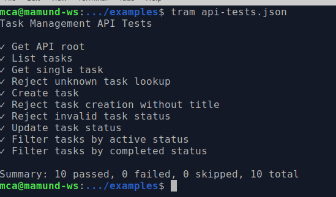

# TRAM

**TRAM** (Test Runner for Assertion Manifests) is a lightweight, dependency-free HTTP API behavioral testing platform for Node.js.


TRAM combines:

* a manifest-driven test format
* a reusable assertion engine
* a portable HTTP test runner
* stable runtime interpolation support
* native type assertions
* optional property assertions
* object-map and collection assertions
* layered behavioral modeling
* workflow-oriented behavioral validation
* an AI Coaching workflow focused on learning and augmentation rather than pure automation

TRAM treats API testing as behavioral modeling rather than framework scripting.



---

# Smallest complete TRAM manifest

```json
{
  "name": "Smallest TRAM manifest",
  "tests": [
    {
      "name": "GET /tasks returns 200",
      "request": {
        "method": "GET",
        "path": "/tasks"
      },
      "expect": {
        "status": 200,
      }
    }
  ]
}
```

This is the smallest useful complete TRAM manifest:

* one manifest
* one test
* one request
* one behavioral assertion

---

# Why TRAM exists

Modern API systems already have strong tooling around structure and implementation:

* OpenAPI generation
* schema validation
* SDK generation
* monitoring
* scaffolding
* AI-assisted code generation

At the same time, distributed systems often fail behaviorally rather than structurally.

A response may validate correctly while:

* workflows drift
* affordances disappear
* assumptions diverge
* state transitions become inconsistent
* operational expectations become fragmented across teams and tools

TRAM explores a narrower problem:

```text
How do we make behavioral expectations directly visible,
portable, executable, and reviewable?
```

The core artifact is the manifest:

```text
api-tests.json
```

The manifest defines:

* requests
* request bodies
* assertions
* expected behaviors
* shared test data
* runtime interpolation values

Assertions become directly inspectable operational statements.

Example:

```json
{
  "path": "$.status",
  "equals": "active"
}
```

TRAM supports partial and evolving representations through optional property assertions while preserving explicit behavioral validation.

---

# Behavioral layering

TRAM organizes behavioral testing into six progressive layers.

```text
Level 0 — Surface
Can the API be reached?

Level 1 — Shape
Do resources and affordances appear correctly?

Level 2 — Safe behavior
Do navigation, lookup, filtering, and query interactions behave correctly?

Level 3 — Unsafe behavior
Do isolated state-changing actions behave correctly?

Level 4 — Workflow
Can meaningful operational narratives be completed successfully?

Level 5 — Governance
Are policies, constraints, and semantic rules enforced correctly?
```

The layers are additive rather than replacement-oriented.

Each layer narrows debugging scope while preserving readable behavioral intent.

---

# Project goals

TRAM is designed around several principles:

* behavioral tests over implementation tests
* portable manifests over framework lock-in
* readable intent over clever abstractions
* explicitness over hidden runtime behavior
* low-noise reporting
* augmentation and learning over one-shot generation

The long-term direction is an AI Coach that helps users learn behavioral API testing while collaboratively constructing executable manifests.

---

# Current implementation

Current implementation includes:

* manifest specification (`api-tests.json`)
* dependency-free assertion engine
* dependency-free HTTP runner
* body/header/status assertions
* collection assertions (`each`)
* object-map assertions (`eachProperty`)
* native type assertions (`type`)
* optional property assertions (`optional`)
* range assertions (`range`)
* stable run-scoped variables
* runtime interpolation (`${data.*}`)
* object injection (`$data.*`)
* happy-path and sad-path testing
* JSON, form, and text request body support
* workflow-oriented behavioral modeling
* machine-readable reporting
* real API validation against a sample CRUD-style task API

---

# Project structure

```text
.
├── README.md
├── package.json
├── api-tests.json
├── bin/
│   └── tram
├── lib/
│   └── assertions.js
├── docs/
└── sample-api/
```

---

# CLI installation

## Local development setup

Clone the repository:

```bash
git clone https://github.com/mamund/2026-05-tram.git
cd 2026-05-tram
```

macOS/Linux:

```bash
chmod +x bin/tram
npm link
```

Windows:

```bash
npm link
```

Then run:

```bash
tram api-tests.json
```

---

# Core concepts

## Manifest-driven testing

Tests are defined declaratively in a manifest:

```json
{
  "name": "Create task",
  "method": "POST",
  "path": "/tasks/${data.stableId}",
  "body": "$data.task.valid",
  "expect": {
    "status": 201,
    "body": [
      {
        "path": "$.status",
        "equals": "active"
      }
    ]
  }
}
```

The manifest acts as both:

* executable configuration
* behavioral operational artifact

---

## Shared runtime data

The `data` section stores reusable request and runtime values.

Example:

```json
{
  "data": {
    "stableId": "${randomId}"
  }
}
```

The generated value remains stable throughout the current test run.

Later requests can reference the same value:

```json
{
  "path": "/tasks/${data.stableId}"
}
```

This enables coordinated multi-step behavioral flows without introducing custom scripting.

---

## Runtime interpolation semantics

Use:

```json
"$data.someObject"
```

when injecting structured runtime objects.

Use:

```json
"${data.someValue}"
```

when interpolating values inside strings.

Examples:

Correct object injection:

```json
"body": "$data.createTask"
```

Correct string interpolation:

```json
"path": "/tasks/${data.knownTaskId}"
```

---

## Assertion engine

The assertion library currently supports:

```text
exists
equals
contains
oneOf
type
range
isArray
hasProperties
minLength
each
eachProperty
```

Native type assertions support:

```text
string
number
boolean
array
object
null
```

Example native type assertion:

```json
{
  "path": "$.priority",
  "type": "number"
}
```

Example optional property assertion:

```json
{
  "path": "$",
  "each": {
    "property": "description",
    "optional": true,
    "type": "string"
  }
}
```

This assertion means:

```text
"description" may be absent
if present, it must still validate as a string
```

---

## Traversal semantics

TRAM distinguishes between arrays and object maps.

Use:

* `each` for arrays
* `eachProperty` for object maps

Examples:

```json
[
  {...},
  {...}
]
```

```text
=> each
```

```json
{
  "self": {...},
  "edit": {...}
}
```

```text
=> eachProperty
```

TRAM also distinguishes between:

* `path` for structural traversal
* `property` for scalar leaf checks

Example structural traversal:

```json
{
  "path": "$",
  "each": {
    "path": "$._links",
    "eachProperty": {
      "hasProperties": ["href", "method"]
    }
  }
}
```

Example scalar leaf assertion:

```json
{
  "path": "$",
  "each": {
    "property": "status",
    "equals": "active"
  }
}
```

The assertion model supports:

* collection traversal
* nested traversal
* object-map iteration
* native value validation
* optional property validation
* hypermedia affordance validation

while remaining declarative and inspectable.

TRAM intentionally limits type assertions to native value categories.

The following are currently out of scope:

```text
uuid
email
uri
date-time
schema validation
```

---

## Workflow-oriented behavioral modeling

TRAM manifests can model operational workflows rather than isolated endpoint checks.

A workflow manifest may:

* create resources
* retrieve intermediate state
* apply mutations
* verify accumulated final state

This allows manifests to function as executable operational narratives.

Example workflow sequence:

```text
create
read after create
edit
update status
assign user
set due date
read final accumulated state
```

---

## Header assertion semantics

Header assertions use:

```json
{
  "name": "content-type",
  "contains": "application/json"
}
```

Do not use `path` for header assertions.

---

## Request body support

TRAM supports multiple request body encodings:

```text
json
form
text
```

Example:

```json
{
  "method": "PUT",
  "path": "/tasks/task-1/status",
  "bodyType": "form",
  "body": "$data.task.updateStatus"
}
```

---

# Running the sample project

Start the sample API:

```bash
node sample-api/index.js
```

Run the test suite:

```bash
tram api-tests.json
```

Verbose mode:

```bash
tram api-tests.json --verbose
```

Generate a machine-readable report:

```bash
tram api-tests.json --report results.json
```

---

# Documentation

## Quick Start

Practical walkthrough for:

* running the sample project
* inspecting manifests
* understanding assertions
* understanding runtime interpolation
* exploring behavioral API testing workflows

## Manifest Specification

Authoritative executable manifest model.

Defines:

* manifest structure
* request configuration
* assertion syntax
* optional property assertions
* traversal behavior
* runtime interpolation
* stable run-scoped variables
* collection assertions
* object-map assertions
* native type assertions
* body handling

## Explainer

Architectural discussion of:

* behavioral assertions
* operational artifacts
* hypermedia-oriented testing
* generated systems
* workflow-oriented behavioral modeling
* AI-assisted workflows

---

# Reporting philosophy

TRAM emphasizes:

* low-noise console output
* readable failures
* behavior visibility
* detailed machine-readable reports

The console output is intentionally concise by default.

---

# Design philosophy

TRAM is intentionally conservative.

v0.1 avoids:

* framework dependencies
* custom scripting
* setup/teardown orchestration
* schema engines
* plugin systems
* hidden runtime behavior

The current emphasis is:

```text
clarity
predictability
behavior visibility
manifest ergonomics
reviewability
```

---

# AI Coaching direction

The AI Coaching direction includes:

* layered manifest generation
* traversal-aware assertion guidance
* workflow modeling support
* governance distinction guidance
* collaborative review cycles
* behavioral decomposition assistance

The eventual AI Coach layer will:

1. inspect `server.js` and/or API Story documents
2. identify API behaviors
3. propose candidate tests
4. distinguish happy and sad paths
5. review assertions collaboratively
6. generate plausible first-pass manifests

The goal is not automatic test generation alone.

The goal is helping users understand behavioral API testing while collaboratively constructing executable manifests.

---

# Example layer progression

Typical TRAM progression:

```text
Level 0 — endpoint availability
Level 1 — representation structure
Level 2 — lookup and filtering behavior
Level 3 — isolated mutation behavior
Level 4 — workflow continuity
Level 5 — governance and constraints
```

---

# Related ideas

TRAM draws inspiration from:

* behavioral testing
* executable specifications
* hypermedia-oriented design
* affordance-centric APIs
* augmentation-oriented AI systems
* coaching-based human/machine collaboration

---

# Status

Early experimental project.

Interfaces and manifest formats will evolve during v0.x development.

Project repository:

```text
https://github.com/mamund/2026-05-tram
```
